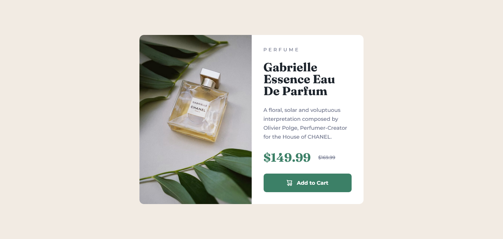

# Frontend Mentor - Product preview card component solution

This is a solution to the [Product preview card component challenge on Frontend Mentor](https://www.frontendmentor.io/challenges/product-preview-card-component-GO7UmttRfa). Frontend Mentor challenges help you improve your coding skills by building realistic projects. 

## Table of contents

- [Overview](#overview)
  - [The challenge](#the-challenge)
  - [Screenshot](#screenshot)
  - [Links](#links)
- [My process](#my-process)
  - [Built with](#built-with)
  - [What I learned](#what-i-learned)
  - [Continued development](#continued-development)
  - [Useful resources](#useful-resources)
- [Author](#author)

## Overview

### The challenge

Users should be able to:

- View the optimal layout depending on their device's screen size
- See hover and focus states for interactive elements

### Screenshot

### Links

- Solution URL: [Add solution URL here](https://your-solution-url.com)
- Live Site URL: [https://lucasngtg.github.io/product-preview-card-component/](https://lucasngtg.github.io/product-preview-card-component)

## My process

### Built with

- Semantic HTML5 markup
- CSS custom properties
- Flexbox
- CSS Grid
- Mobile-first workflow
- CSS variables
- HTML picture

### What I learned

I used CSS variables to store the design colours, font families and font sizes. Certainly something I'll do again in the future. Made the mobile page first, which I hadn't done before. Apparently, that is the approach suitable to the market.

Used the `picture` tag in order to change the image depending on the screen size. It turns out that the element that is displayed on the page is always the `img`, with `source` only being there as an override of some attributes depending on specified parameters.

I should use the CSS Grid more often.

### Continued development

Responsiveness is harder than it seems. Definetely something that requires practical experience to fully grasp.

### Useful resources

- [web.dev's article on the picture element](https://web.dev/learn/design/picture-element?continue=https%3A%2F%2Fweb.dev%2Flearn%2Fdesign%23article-https%3A%2F%2Fweb.dev%2Flearn%2Fdesign%2Fpicture-element)

## Author

- Frontend Mentor - [@LucasNgTg](https://www.frontendmentor.io/profile/LucasNgTg)
- GitHub - [@LucasNgTg](https://https://github.com/LucasNgTg)